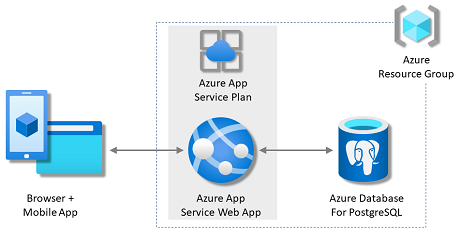

# Deploy Pexip Policy Router to Azure

### Azure Services Diagram

## Azure Services List

- **Web App**    Provides serverless  web services for UI & Policy requests for the Django framework
- **Azure Database for PostgreSQL flexible server**     Provides serverless persistent SQL server used by Django framework
- **App Service Plan**     Provides underlying enviroment (Linux), compute & pricing plan to support the web app

## Deployment

Azure portal can be used for ease of use to create the above resources.

### Reference

https://learn.microsoft.com/en-us/azure/app-service/configure-language-python

https://learn.microsoft.com/en-us/azure/app-service/tutorial-python-postgresql-app-django?tabs=copilot&pivots=azure-portal

### Configure Azure resources

Once the Azure Web App has been deployed enviroment variables are used by the Django app settings:

- **SCM_DO_BUILD_DURING_DEPLOYMENT** Should be set to true by default
- **DISABLE_COLLECTSTATIC**     Set to true
- **DB_NAME**     "postgres" by default
- **DB_USER**     SQL admin username configured when creating Azure PostgreSQL service
- **DB_PW**     SQL admin password configured when creating Azure PostgreSQL service
- **DB_HOST**     SQL endpoint/hostname configured when creating Azure PostgreSQL service e.g. dbname.postgres.database.azure.com

These enviroment variables can be configured directly in Azure Portal or using VSCode with Azure Extensions

### Deploy app

Use VSCode to deploy the repo to Web App

### Post Deploy

Once app is deployed the database needs to be managed

- SSH onto app via Azure Portal

Run database migration & super user commands:

- `python manage.py migrate --settings pexip_policy_router.settings_AzureWebApp`
- `python manage.py createsuperuser --settings pexip_policy_router.settings_AzureWebApp`
