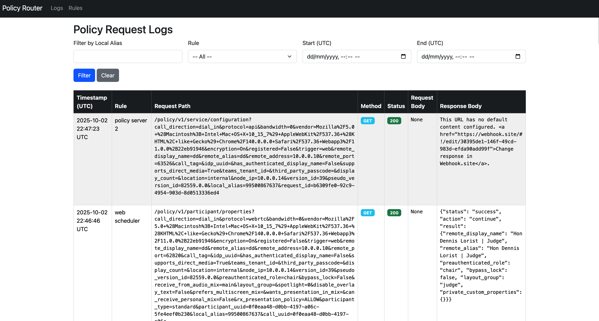

# Pexip Policy Router

A Django-based proxy and management interface for routing **Pexip Infinity Service** and **Participant Policy** requests.  
This project allows administrators to configure regex-based rules to forward policy requests to one or more upstream policy servers, with support for:

- **Service policy proxying** (`/policy/v1/service/configuration`)
- **Participant policy proxying** (`/policy/v1/participant/properties`)
- **Regex-based rule matching** on `local_alias`
- **Rule priorities** (lower numbers evaluated first)
- **Optional Basic Authentication** per upstream
- **Request/response logging** with a searchable log viewer

---

## Screenshots

### Rule Management


### Logs Viewer


### Logs Viewer


---
## 🚀 Features

- Configure rules from the Django web UI
- Match requests by `local_alias` regex
- Forward requests to multiple upstream policy servers
- Basic Auth support per rule
- Logs every request and response for auditing
- Log viewer with filters by `local_alias`, rule, and date/time
- Modern Bootstrap 5 UI for managing rules and viewing logs

---

## 📦 Requirements

- Python **3.11+**
- Django **5.0+**
- httpx

Dependencies are listed in `requirements.txt`.

---

## ⚙️ Installation

1. Clone the repository:

   ```bash
   git clone https://github.com/your-org/pexip-policy-router.git
   cd pexip-policy-router

2. Create a virtual environment and install dependencies:

    ```bash
    python3 -m venv venv
    source venv/bin/activate   # On Linux/macOS
    venv\Scripts\activate      # On Windows

    pip install -r requirements.txt

3. Run migrations:

    ```bash
    python manage.py makemigrations policy_router
    python manage migrate

4. Create superuser (optional):

    ```bash
    python manage.py createsuperuser

5. Start the development server:

    ```bash
    python manage.py runserver 10.0.0.10:8000

## 🛠️ Usage

- Rules UI: Visit http://10.0.0.10:8000/rules/ to create, edit, and delete rules.
- Logs UI: Visit http://10.0.0.10:8000/logs/ to search and view request logs.

### Example Rule

- Local Alias Regex: ^room-\d+$
- Service Policy Target: https://upstream.example.com
- Participant Policy Target: https://upstream.example.com
- Priority: 1
- Basic Auth: username / password

### Log rotation

As this is a POC, you can add log rotation to a crod job or run manually. Proper implementation would be to use something like a Celery Beat Task

    ```bash
    python manage.py rotate_logs --days=30

