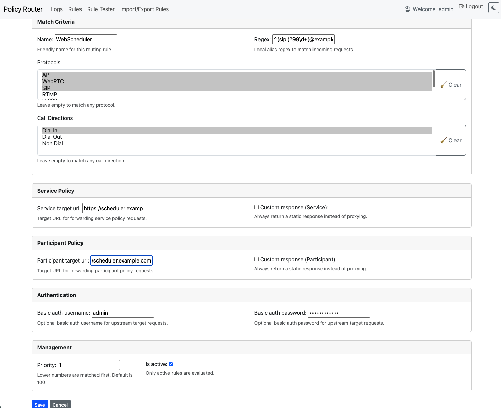

# Pexip Policy Router

A Django-based proxy and management interface for routing **Pexip Infinity Service** and **Participant Policy** requests.  
This project allows administrators to configure regex-based rules to forward policy requests to one or more upstream policy servers, with support for:

- **Service policy proxying** (`/policy/v1/service/configuration`)
- **Participant policy proxying** (`/policy/v1/participant/properties`)
- **Regex-based rule matching** on `local_alias`
- **Rule matching** on `call_direction` and/or `protocol`
- **Rule priorities** (lower numbers evaluated first)
- **Optional Basic Authentication** per upstream
- **Request/response logging** with a searchable log viewer

---

## Screenshots

### Rule Management


### Rule Form


### Logs Viewer


---
## ✨ Features

- **Rule-based routing**
  - Match requests based on `local_alias` regex
  - Rules are applied in **priority order** (lowest number first)
  - Active/inactive toggle per rule

- **Overrides**
  - Rules can be configured to **always return a JSON response** instead of forwarding upstream
  - Default override responses:
    ```json
    { "status": "success", "action": "continue" }
    ```
  - Custom JSON responses can be defined per rule for:
    - Service policy (`/policy/v1/service/configuration`)
    - Participant policy (`/policy/v1/participant/properties`)

- **Authentication**
  - Supports optional **Basic Auth** for upstream targets

- **Logging**
  - Every request and response is logged in the database
  - Logs include:
    - Rule matched
    - Request path, method, body
    - Response status and body
    - Whether the rule was an **override**
  - Logs UI:
    - Filter by rule, alias, date/time
    - Highlight search terms
    - Pretty-printed JSON with syntax highlighting

- **Admin & UI**
  - Manage rules through Django Admin or custom HTML forms
  - Add/edit/delete rules
  - Override toggles with JSON editor fields
  - Logs displayed with pagination, highlighting, and JSON pretty-printing

- **Deployment Ready**
  - Includes `.gitignore`, `requirements.txt`
---

##  Requirements

- Python **3.11+**
- Django **5.0+**
- httpx

Dependencies are listed in `requirements.txt`.

---

##  Installation

1. Clone the repository:

   ```bash
   git clone https://github.com/your-org/pexip-policy-router.git
   cd pexip-policy-router

2. Create a virtual environment and install dependencies:

    ```bash
    python3 -m venv venv
    source venv/bin/activate   # On Linux/macOS
    venv\Scripts\activate      # On Windows

    pip install -r requirements.txt

3. Run migrations:

    ```bash
    python manage.py makemigrations policy_router
    python manage.py migrate

4. Create superuser (optional):

    ```bash
    python manage.py createsuperuser

5. Start the development server:

    ```bash
    python manage.py runserver 0.0.0.0:8000

##  Usage

- Rules UI: Visit http://localhost:8000/rules/ to create, edit, and delete rules.
- Logs UI: Visit http://localhost:8000/logs/ to search and view request logs.

### Example Rule

- Local Alias Regex: ^room-\d+$
- Service Policy Target: https://upstream.example.com
- Participant Policy Target: https://upstream.example.com
- Priority: 1
- Basic Auth: username / password

### Log rotation

As this is a POC, you can add log rotation to a crod job or run manually. Proper implementation would be to use something like a Celery Beat Task

    ```bash
    python manage.py rotate_logs --days=30

### Deploy to Azure WebApp - Linux
  See DeployAzureWebApp.md

### Authentication

The application is configured to use the superuser credentials configured in step 4. The policy endpoints also use these credentials, so add them to the configration of the external policy server in the Infinity policy profile.

To disable or enable authentication for the app, adjust the settings in the settings.py file:

    ```bash
    # Authentication toggles
    ENABLE_WEB_AUTH = True        # Require login for web views (/rules)
    ENABLE_POLICY_AUTH = True     # Require Basic Auth for policy endpoints
