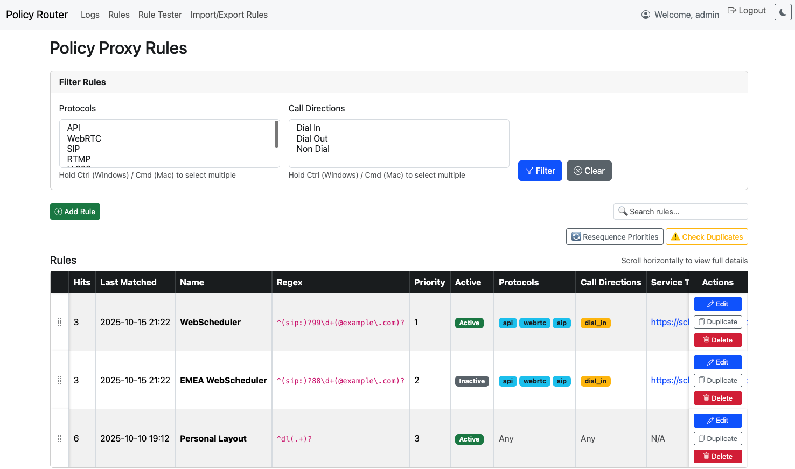

# Pexip Policy Router

A **Django-based proxy and management interface** for routing **Pexip Infinity Service** and **Participant Policy** requests.  
Administrators can configure **regex-based rules** to forward or override policy requests to one or more upstream servers — with live metrics, duplicate detection, and a modern web UI.

---

## Core Capabilities

- **Service Policy Proxy** → `/policy/v1/service/configuration`  
- **Participant Policy Proxy** → `/policy/v1/participant/properties`
- **Regex Rule Matching** on `local_alias`
- **Optional filters** for `protocol` and `call_direction`
- **Rule Priority Ordering** (lower numbers evaluated first)
- **Basic Authentication** per upstream
- **Full request / response logging**
- **Web UI for rules & logs**
- **Import / Export via CSV**

---

## Modern UI Features

| Feature | Description |
|----------|--------------|
| **Drag-and-Drop Reordering** | Easily change rule priorities by dragging rows — instant persistence |
| **Duplicate Detection** | Identifies overlapping regex patterns, with tooltips showing overlap examples |
| **Usage Metrics** | Each rule tracks hit count and last-matched timestamp |
| **CSV Import / Export** | Backup or bulk-edit all rules via a simple CSV |
| **Rule Duplication** | One-click cloning of existing rules |
| **Basic Auth Configurable per Rule** | Different upstream credentials per target |
| **Override Responses** | Instantly return custom JSON for service or participant policies |
| **Log Viewer** | Filter by rule, alias, and date — with syntax-highlighted JSON |
| **Filter Memory & Live Search** | Filters persist across sessions for smooth UX |
| **Sticky Table Columns** | “Grip” and “Actions” columns always visible — no horizontal scrolling |

---

## Screenshots

### Rules Dashboard  


### Edit Rule  


### Logs Viewer  


### Export/import rules 


---

##  Highlights

### Rule-Based Routing
- Rules evaluated by ascending priority
- Match against `local_alias`, `protocol`, and `call_direction`
- Optional JSON override instead of proxying upstream

### Override Mode
Define static responses for fast local handling:
```json
{ "status": "success", "action": "continue" }
```
Used for service and participant endpoints independently.

### Secure Proxying
- Supports per-rule **Basic Auth** to authenticate against remote policy servers  
- Automatically strips hop-by-hop headers before forwarding

### Logging
- Every request/response is stored with:
  - Rule matched
  - Alias and parameters
  - Upstream URL and response code
  - Override flag
- Web UI includes:
  - Filter/search by alias, rule, or timeframe
  - Syntax-highlighted JSON
  - Pagination and export options

---

## Installation for a dev environment

### Requirements
- **Python 3.11+**
- **Django 5.0+**
- **httpx**

### Steps
```bash
git clone https://github.com/your-org/pexip-policy-router.git
cd pexip-policy-router

python3 -m venv venv
source venv/bin/activate   # macOS/Linux
venv\Scripts\activate      # Windows

pip install -r requirements.txt
python manage.py makemigrations policy_router
python manage.py migrate
python manage.py createsuperuser
python manage.py runserver 0.0.0.0:8000
```

---

## Usage

### Web UI
- Rules: [http://localhost:8000/rules/](http://localhost:8000/rules/)
- Logs: [http://localhost:8000/logs/](http://localhost:8000/logs/)

### Example Rule
| Field | Example |
|-------|----------|
| Local Alias Regex | `^(sip:)?99\d+(@example.com)?` |
| Service Policy Target | `https://webscheduler.example.com` |
| Participant Policy Target | `https://webscheduler.example.com` |
| Priority | `1` |
| Basic Auth | `username` / `password` |

### Log Rotation
```bash
python manage.py rotate_logs --days=30
```
*(Can be scheduled with cron or Celery Beat.)*

---

## Deploy to Azure Web App (Linux)

See [DeployAzureWebApp.md](DeployAzureWebApp.md) for deployment notes.

---

## Authentication

The app uses Django’s authentication system.  
By default:
- Web UI requires login (`ENABLE_WEB_AUTH = True`)
- Policy endpoints can require Basic Auth (`ENABLE_POLICY_AUTH = True`)

Configured in `settings.py`:
```python
ENABLE_WEB_AUTH = True        # Require login for web views
ENABLE_POLICY_AUTH = True     # Require Basic Auth for /policy endpoints
```

Add the same credentials to your **Infinity External Policy Server** configuration.

---
